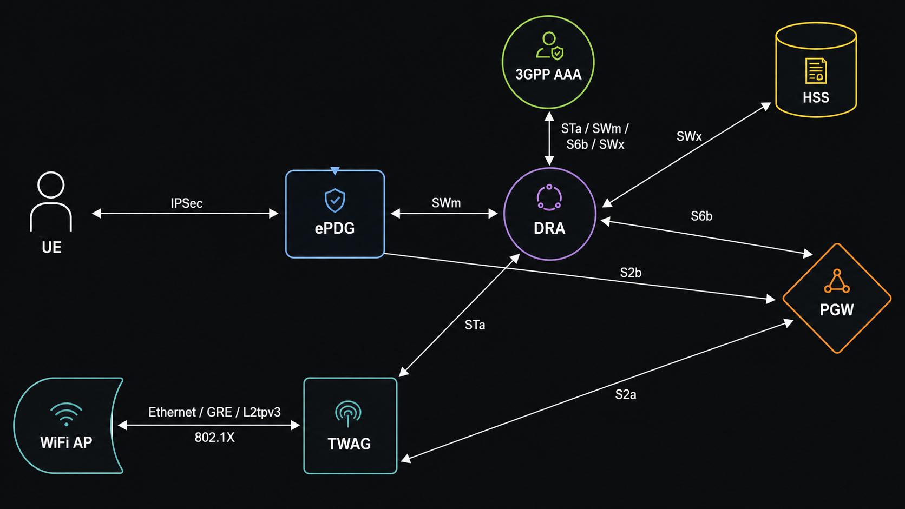

# VectorCore ePDG

VectorCore ePDG is a production-grade Evolved Packet Data Gateway written in Go. It implements the full VoWiFi control plane and BPF datapath as a single self-contained binary. 

## What It Does

An ePDG provides untrusted non-3GPP access to the Evolved Packet Core (EPC), enabling devices to use Wi-Fi for VoWiFi voice and data services via a secured IPsec tunnel authenticated with the SIM card (EAP-AKA).

```
Phone / UE
    |
    |  SWu — IKEv2 + EAP-AKA + IPsec/ESP
    |
VectorCore ePDG
    |                    |                     |
    | SWm Diameter       | S2b GTPv2-C         | Linux XFRM
    | EAP-AKA proxy      | PDN session/bearer  | kernel IPsec
    |                    |                     |
   AAA / HSS            PGW                   GTP-U dataplane
```




## Features

- **Native Go IKEv2** — Full RFC 7296 state machine: IKE_SA_INIT, IKE_AUTH, CHILD SA, DH key exchange, NAT-T, rekey, reauthentication, DPD
- **EAP-AKA authentication** — SIM-based auth proxied over SWm Diameter to the HSS/AAA (3GPP TS 29.273)
- **Kernel IPsec via XFRM** — Inbound/outbound XFRM SAs and policies installed directly in the Linux kernel; ESP-in-UDP for NAT traversal
- **MOBIKE (RFC 4555)** — IKEv2 Mobility: negotiated in IKE_AUTH, COOKIE2 return-routability challenge/verify, XFRM endpoint migration when the UE changes IP address (e.g. roaming between Wi-Fi networks); supported on IPv4 and IPv6, but migrating mid-session between address families (v4 path ↔ v6 path) is rejected and logged
- **S2b GTPv2-C** — Creates and manages PDN sessions with the PGW (3GPP TS 29.274); Cisco StarOS interop validated
- **DNS-based PGW discovery** — Per-attach S-NAPTR lookup (3GPP TS 29.303) resolves the PGW-C address from the APN-FQDN, preferring the `x-3gpp-pgw:x-s2b-gtp` service with optional fallback to `x-s5-gtp`/`x-s8-gtp`; falls back to the static `gtp.pgw_gtpc` address on DNS failure or when disabled
- **BPF GTP-U dataplane** — XDP downlink decap and TC uplink encap with Linux TUN/XFRM integration; GTP-U Echo remains on the UDP/2152 control socket
- **Dedicated bearer support** — PGW-initiated Create/Delete/Update Bearer procedures with TFT uplink packet selection
- **PCO/APCO** — DNS, P-CSCF IPv4 and IPv6 decoded from S2b and delivered to the UE via IKEv2 CFG_REPLY (RFC 7651 attribute types 20 and 21)
- **Bidirectional VoWiFi ↔ VoLTE handover** — VoWiFi→VoLTE: detects PGW Cause=10 (Access changed from Non-3GPP to 3GPP) on Delete Bearer and sends SWm STR with Termination-Cause=8 (DIAMETER_USER_MOVED) for clean AAA handover. VoLTE→VoWiFi: detects non-zero INTERNAL_IP4_ADDRESS in IKE_AUTH CFG_REQUEST and sets the Handover Indication (HI) bit in the S2b Create Session Indication IE so the PGW preserves the existing PDN connection and assigns the same IP address
- **Lifecycle management** — IKE SA delete, CHILD SA delete, DPD, PGW-initiated delete; full teardown of XFRM + GTP-U + S2b state
- **Reauthentication** — A new IKE_AUTH from an already-attached IMSI+APN (without a handover indication) is treated as an implicit detach of the existing session followed by a fresh PDN attach, per 3GPP TS 23.402
- **Dual-stack SWu (IPv4 + IPv6 outer tunnel)** — IKEv2 and IPsec/ESP over IPv6 transport in addition to IPv4, opt-in via `ikev2.listen_addr_v6` (3GPP TS 24.302 §7.2.2); the inner PDN connection (PAA, S2b, GTP-U) remains IPv4-only
- **Read-only administrative API** — Huma-based HTTP API (`/api/v1`) for connected subscribers, IKE/IPsec/S2b session detail, and BPF dataplane statistics; OpenAPI spec and Swagger UI at `/docs`. Disabled by default; see [docs/API.md](docs/API.md)
- **3GPP compliant** — Implements TS 23.402, TS 24.302, TS 29.273, TS 29.274, TS 29.303, TS 33.402


## Related Components

### 3GPP AAA Server

This ePDG can use the [VectorCore AAA Server](https://github.com/svinson1121/vectorcore-aaa) as the 3GPP AAA component for non-3GPP access authentication and authorization.

The AAA server provides the authentication path used by:

- **ePDG** access via **SWm** toward the 3GPP AAA Server
- AAA/HSS interaction via **SWx**
- AAA/PGW interaction via **S6b**

## Requirements  

### Runtime

- Linux kernel 5.15+ with XFRM, TUN/TAP, and BPF JIT support
- `iproute2` with `tc` support for attaching the uplink BPF program
- Root privileges — required for XFRM netlink, raw sockets, TUN device creation, and BPF program loading
- IP forwarding enabled: `sysctl net.ipv4.ip_forward=1`
- `/sys/fs/bpf` mounted (standard on all modern distributions)

### Build

- Go 1.22+
- `clang` 14+ and `llvm` — required to compile BPF C programs (`make generate`)
- `libbpf-dev` — provides `<bpf/bpf_helpers.h>` and `<bpf/bpf_endian.h>` used by BPF programs

On Debian/Ubuntu:
```bash
apt install clang llvm libbpf-dev
```

## Build

```bash
make
```

Output binary: `bin/epdg`

Build-time variables:

| Variable | Default | Description |
|---|---|---|
| `VERSION` | `0.1.1d` | Version string injected via ldflags |
| `GOCACHE` | `/tmp/vectorcore-epdg-gocache` | Go build cache path |
| `GOMODCACHE` | `/tmp/vectorcore-epdg-gomodcache` | Go module cache path |

Override at build time:

```bash
make build VERSION=1.2.0
```

### Other targets

```bash
make generate  # compile BPF C programs and embed bytecode (requires clang + libbpf-dev)
make tidy      # go mod tidy
make test      # run all tests
make clean     # remove bin/
make install   # build and install to /opt/vectorcore/epdg/bin/epdg
```

`make build` runs `make generate` first. Run `make generate` on its own only if you want to recompile BPF programs without rebuilding the binary.

### Install

```bash
make install
```

Creates:
- `/opt/vectorcore/epdg/bin/epdg` — binary
- `/etc/vectorcore/epdg/` — config directory
- `/var/log/vectorcore/epdg/` — log directory

## Usage

```
epdg [flags]

  -c <path>    Config file (default: /opt/vectorcore/etc/epdg.yaml)
  -d           Enable debug console logging
  -validate    Load and validate config, then exit
  -v           Print version and exit
```

On startup the binary prints `Starting VectorCore ePDG <version>` to stdout, then logs to the configured log file.

## Certificates

The ePDG presents an X.509 certificate to the UE during IKE_AUTH. The UE uses this certificate to authenticate the ePDG before completing the EAP-AKA exchange. `cert_file` is required — the binary will not start without it.

### Using an existing PKI

If your operator PKI has already issued an ePDG certificate, point the config at those files:

```yaml
ikev2:
  cert_file: /etc/vectorcore/epdg/epdg.crt
  key_file:  /etc/vectorcore/epdg/epdg.key
  ca_file:   /etc/vectorcore/epdg/ca.crt
```

The certificate's Subject or Subject Alternative Name should match the ePDG FQDN configured in `epdg.name` (e.g. `epdg.epc.mnc001.mcc001.3gppnetwork.org`).

### Generating a self-signed CA and ePDG certificate

For lab or testing environments you can generate your own CA and issue an ePDG certificate from it.

**1. Generate the CA key and self-signed CA certificate**

```bash
openssl genrsa -out ca.key 4096

openssl req -x509 -new -nodes \
  -key ca.key \
  -sha256 -days 3650 \
  -subj "/CN=VectorCore ePDG Lab CA" \
  -out ca.crt
```

**2. Generate the ePDG key and certificate signing request**

Replace `epdg.epc.mnc001.mcc001.3gppnetwork.org` with your actual ePDG FQDN.

```bash
openssl genrsa -out epdg.key 2048

openssl req -new \
  -key epdg.key \
  -subj "/CN=epdg.epc.mnc001.mcc001.3gppnetwork.org" \
  -out epdg.csr
```

**3. Sign the ePDG certificate with the CA**

```bash
openssl x509 -req \
  -in epdg.csr \
  -CA ca.crt -CAkey ca.key -CAcreateserial \
  -sha256 -days 825 \
  -extfile <(printf "subjectAltName=DNS:epdg.epc.mnc001.mcc001.3gppnetwork.org") \
  -out epdg.crt
```

**4. Install and configure**

```bash
install -m 0640 ca.crt epdg.crt epdg.key /etc/vectorcore/epdg/
```

```yaml
ikev2:
  cert_file: /etc/vectorcore/epdg/epdg.crt
  key_file:  /etc/vectorcore/epdg/epdg.key
  ca_file:   /etc/vectorcore/epdg/ca.crt
```

The CA certificate (`ca.crt`) must be provisioned on the UE or in the device's trusted root store for the UE to accept the ePDG's identity. In production this is typically handled by the operator PKI and device management.

### Verifying a certificate

```bash
# Confirm the cert and key match
openssl x509 -noout -modulus -in epdg.crt | md5sum
openssl rsa  -noout -modulus -in epdg.key | md5sum

# Verify the cert is signed by the CA
openssl verify -CAfile ca.crt epdg.crt

# Inspect the certificate
openssl x509 -noout -text -in epdg.crt
```

## Configuration

The config file uses a simple `section: / key: value` format. An annotated example is at `config/epdg.yaml`.

### `epdg` — Identity

| Key | Required | Description |
|---|---|---|
| `name` | yes | ePDG FQDN (e.g. `epdg.epc.mnc001.mcc001.3gppnetwork.org`) |
| `realm` | yes | Diameter / IKE realm |
| `mcc` | yes | Mobile Country Code (3 digits) |
| `mnc` | yes | Mobile Network Code (2–3 digits) |
| `mnc_length` | yes | `2` or `3` |

### `logging` — Log output

| Key | Default | Description |
|---|---|---|
| `level` | `info` | Log level: `debug`, `info`, `warn`, `error` |
| `file` | `/var/log/vectorcore/epdg/epdg.log` | Log file path |

### `ikev2` — IKEv2 / SWu interface

| Key | Default | Required | Description |
|---|---|---|---|
| `listen_addr` | `0.0.0.0` | | IPv4 address to bind IKEv2 on ports 500 and 4500 |
| `listen_addr_v6` | (disabled) | | IPv6 address to additionally bind (e.g. `::`). Empty/absent = IPv6 disabled; IPv4 behavior is unaffected either way |
| `listen_ifname` | | | Restrict to a specific network interface by name |
| `cert_file` | | **yes** | Path to the ePDG X.509 certificate (PEM). Startup fails without it |
| `key_file` | | | Path to the ePDG private key (PEM) |
| `ca_file` | | | Path to the CA certificate for trust validation (PEM) |
| `dpd_enabled` | `true` | | Enable Dead Peer Detection |
| `dpd_delay` | `30` | | Idle seconds before sending a DPD probe |
| `dpd_timeout` | `120` | | Seconds to wait for a DPD response before tearing down the IKE SA |

### `swm` — SWm Diameter (EAP-AKA proxy)

| Key | Required | Description |
|---|---|---|
| `local_addr` | yes | Local IP for the Diameter transport |
| `peer_addr` | yes | Diameter peer IP (AAA or DRA) |
| `peer_port` | yes | Diameter peer port (typically `3868`) |
| `proto` | | Transport: `tcp` or `sctp` (default `sctp`) |
| `origin_host` | yes | Diameter Origin-Host (ePDG FQDN) |
| `origin_realm` | yes | Diameter Origin-Realm |
| `destination_host` | | Diameter Destination-Host. Omit to route by realm via DRA |
| `destination_realm` | yes | Diameter Destination-Realm |
| `watchdog_interval_seconds` | | DWR send interval (default `30`) |
| `watchdog_timeout_seconds` | | DWR response timeout (default `10`) |

### `gtp` — GTPv2-C control plane and GTP-U dataplane

| Key | Required | Description |
|---|---|---|
| `local_gtpc` | yes | Local IP for GTPv2-C (S2b control plane) |
| `local_gtpu` | yes | Local IP for GTP-U (user plane) |
| `local_port` | | GTP-U listen port (default `2152`) |
| `pgw_gtpc` | yes | PGW GTPv2-C IP |
| `mtu` | | TUN interface MTU, 576–9000 (default `1400`) |
| `validate_outer_peer` | | Validate GTP-U outer peer IP against PGW (default `true`) |
| `strict_peer_check` | | Drop packets from unexpected peers (default `true`) |
| `max_sequence` | | GTPv2-C sequence cap. Set `8388607` for Cisco StarOS (StarOS defect: rejects sequences with bit 23 set) |

### `pgw_discovery` — DNS-based PGW discovery (3GPP TS 29.303)

| Key | Default | Description |
|---|---|---|
| `dns_enabled` | `false` | Resolve the PGW-C address per attach via S-NAPTR DNS lookup on the APN-FQDN (`<apn>.apn.epc.mnc<MNC>.mcc<MCC>.3gppnetwork.org`) instead of using `gtp.pgw_gtpc` directly. Falls back to `gtp.pgw_gtpc` if the lookup fails or returns no usable record |
| `allow_s5s8_fallback` | `false` | When no `x-3gpp-pgw:x-s2b-gtp` NAPTR record exists, fall back to `x-s5-gtp`/`x-s8-gtp` records. Useful when only an MME-facing PGW record has been published |

The discovery method used for each attach (`static`, `dns_s2b`, or `dns_s5s8_fallback`) is logged at debug level along with the APN and resolved IP. See `docs/pgw-discovery-fteid-fallback-caveat.md` for a known edge case around malformed PGW responses.

Example:
```yaml
pgw_discovery:
  dns_enabled: true
  allow_s5s8_fallback: true
```

### `dedicated_bearers` — Dedicated bearer support

| Key | Default | Description |
|---|---|---|
| `enabled` | `true` | Handle PGW-initiated Create/Delete/Update Bearer requests |
| `tft_uplink_selection` | `false` | Apply TFT packet filters for uplink bearer selection |

### `apn` — APN defaults

| Key | Required | Description |
|---|---|---|
| `default` | yes | APN to use when none can be derived from the IKE IDr payload |

### `pco` — Protocol Configuration Options

| Key | Default | Description |
|---|---|---|
| `enabled` | `true` | Enable PCO/APCO processing |
| `request_dns_v4` | `true` | Request IPv4 DNS server addresses from PGW; only delivered to the UE if also set |
| `request_dns_v6` | `true` | Request IPv6 DNS server addresses from PGW; only delivered to the UE if also set |
| `request_pcscf_v4` | `true` | Request IPv4 P-CSCF addresses from PGW; only delivered to the UE if also set |
| `request_pcscf_v6` | `true` | Request IPv6 P-CSCF addresses from PGW; only delivered to the UE if also set |
| `include_apco` | `true` | Include APCO container in S2b Create Session Request |
| `strict_decode` | `false` | Fail attach on PCO decode errors |

Each `request_*` flag controls both what's requested from the PGW *and* what's
forwarded to the UE via IKEv2 CFG_REPLY — if a PGW volunteers a value the
ePDG didn't request (e.g. via APCO echo), it is not delivered to the UE
unless the corresponding flag is set.

### `shutdown` — Graceful shutdown

| Key | Default | Description |
|---|---|---|
| `timeout_seconds` | `5` | Per-component shutdown timeout in seconds |

### `bpf` — BPF dataplane

Enables GTP-U processing via XDP and TC eBPF programs. The BPF dataplane is
required.

| Key | Default | Description |
|---|---|---|
| `xdp_attach_mode` | `generic` | XDP attachment mode: `generic` (any NIC), `native` (driver support required, full perf), `offload` (NIC hardware) |
| `xdp_interface` | required | Network interface receiving UDP/2152 from PGW and used for uplink redirect |
| `map_max_entries` | `4096` | Maximum entries in BPF session maps (one per active bearer) |

Example:
```yaml
bpf:
  xdp_attach_mode: native
  xdp_interface: eth0
  map_max_entries: 4096
```

See `docs/bpf-dataplane.md` for dataplane details.

### `api` — Administrative API

Read-only HTTP API for operational visibility into subscribers, sessions,
and dataplane statistics. Disabled by default — no authentication, so bind
it to a trusted address if enabled.

| Key | Default | Description |
|---|---|---|
| `enabled` | `false` | Start the admin API listener |
| `listen_address` | `0.0.0.0` | Bind address |
| `listen_port` | `8080` | Bind port |

Example:
```yaml
api:
  enabled: true
  listen_address: "127.0.0.1"
  listen_port: 8080
```

See `docs/API.md` for the full endpoint reference and usage examples.

## Planned Features

The following capabilities are planned for future releases. See `docs/` for detailed implementation plans where available.

| Feature | Notes | Plan |
|---|---|---|

## Supported Algorithms

### IKE SA

| Transform | Supported |
|---|---|
| Encryption | AES-CBC-128, AES-CBC-256 |
| Integrity | HMAC-SHA1-96, HMAC-SHA2-256-128, HMAC-SHA2-512-256 |
| PRF | PRF-HMAC-SHA1, PRF-HMAC-SHA256, PRF-HMAC-SHA512 |
| Diffie-Hellman | Group 14 (2048-bit MODP), Group 15 (3072-bit MODP) |

Proposals are matched in preference order. Preferred: AES-CBC-256 + HMAC-SHA2-256-128 + PRF-SHA-256 + DH14.

### ESP (CHILD SA)

| Transform | Supported |
|---|---|
| Encryption | AES-CBC-128, AES-CBC-256 |
| Integrity | HMAC-SHA1-96, HMAC-SHA2-256-128, HMAC-SHA2-512-256 |
| PFS | Group 14 or Group 15 (preferred); no-PFS accepted as fallback |

Preferred: AES-CBC-256 + HMAC-SHA2-256-128 + PFS DH14.

### Hardware Acceleration

When the CPU supports AES-NI, both crypto paths use hardware acceleration automatically — no configuration required:

- **IKEv2 control plane** — Go's `crypto/aes` selects AES-NI assembly at runtime for IKE SA SK payload encrypt/decrypt (handshake and rekey)
- **XFRM ESP data plane** — the kernel crypto API selects `cbc-aes-aesni` and `hmac(sha256-ssse3)` for every ESP packet when `aesni_intel` is loaded

On startup the binary detects and logs which extensions are present (`aes_ni`, `ssse3`, `pclmulqdq`) and confirms whether the kernel XFRM layer is using hardware-backed AES. If AES-NI is absent a warning is logged with the throughput impact and corrective action.

## Protocol Standards

| Interface / Feature | Standard |
|---|---|
| SWu (UE ↔ ePDG) | RFC 7296 (IKEv2), RFC 4187 (EAP-AKA), RFC 4303 (ESP), RFC 3948 (NAT-T); outer tunnel dual-stack IPv4/IPv6 per TS 24.302 §7.2.2 |
| MOBIKE | RFC 4555 — IKEv2 Mobility and Multihoming |
| SWm (ePDG ↔ AAA) | 3GPP TS 29.273 — Diameter EAP-AKA proxy |
| S2b (ePDG ↔ PGW) | 3GPP TS 29.274 — GTPv2-C |
| PGW discovery | 3GPP TS 29.303 — DNS-based S-NAPTR PGW resolution |
| GTP-U dataplane | 3GPP TS 29.281 |
| Handover | 3GPP TS 23.402 §8.6 (VoWiFi↔VoLTE), TS 24.302 §8.2.3 (VoLTE→VoWiFi CFG_REQUEST) |


## Architecture

```
cmd/epdg/main.go          — Entry point, component wiring, PGW event handlers

internal/ikev2            — IKEv2 state machine, packet engine, CHILD SA negotiation
internal/xfrm             — Linux XFRM netlink: kernel IPsec SA and policy
internal/swm              — SWm Diameter client, EAP-AKA challenge/response proxy
internal/s2b              — S2b GTPv2-C client, PDN session and bearer lifecycle
internal/gtpu             — GTP-U dataplane: UDP/2152 control socket, TUN interface, BPF XDP/TC programs
internal/session          — Session FSM and cross-component cleanup coordination
internal/config           — Config file loader and validator
internal/pco              — PCO/APCO encode/decode (3GPP TS 24.008)
internal/logging          — Structured logging (slog, file + console)
```

## Credits

### eUPF — Edgecom LLC

The BPF header files under `internal/gtpu/bpf/headers/` are adapted from the [eUPF](https://github.com/edgecomllc/eupf) project by Edgecom LLC, used under the [Apache License 2.0](https://www.apache.org/licenses/LICENSE-2.0).

Copyright 2023-2025 Edgecom LLC

The following files are derived works:

- `internal/gtpu/bpf/headers/gtpu.h` — GTP-U header definitions
- `internal/gtpu/bpf/headers/csum.h` — checksum helpers
- `internal/gtpu/bpf/headers/packet_context.h` — BPF packet context struct (PFCP fields removed)
- `internal/gtpu/bpf/headers/parsers.h` — Ethernet/IP/UDP parsers (TCP and PFCP helpers removed)
- `internal/gtpu/bpf/headers/gtp_utils.h` — GTP parse and header-strip helpers (echo and encap helpers removed)
- `internal/gtpu/bpf/headers/routing.h` — FIB lookup / IPv4 routing helper (per-CPU stats removed)

### free5GC

vectorcore-ePDG's IKEv2 implementation builds on [free5gc/ike](https://github.com/free5gc/ike),
the IKEv2 library originally developed for the [free5GC](https://github.com/free5gc) project
(a Linux Foundation 5G core network project). We're grateful to the free5gc team and
contributors for their work on a clean, well-tested Go IKEv2 implementation.

- **Project:** [free5gc/ike](https://github.com/free5gc/ike)
- **License:** Apache License 2.0
- **Used for:** IKEv2 session establishment and SA negotiation in the ePDG control plane
